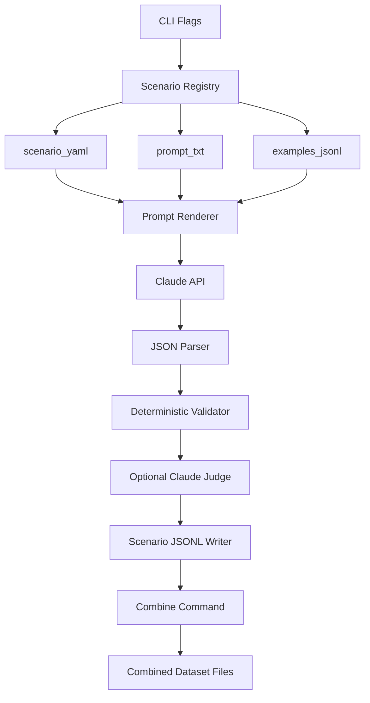

# Generation Design

## Summary

The generator is built around scenario packs. A scenario pack defines one data-generation behavior using:

- `scenario.yaml` for metadata, counts, constraints, and output path
- `prompt.txt` for Claude instructions
- `examples.jsonl` for few-shot examples and dry-run output

Generation writes per-scenario JSONL files. The combine step creates aggregate datasets.

## Dataset Types

- `single_turn`
- `clarification`
- `no_tool`
- `multi_turn`

There is no positive/negative naming in the new design.

## Output Strategy

Each scenario owns its output file:

```text
data/raw/single_turn/initiate_transfer/vendor_payment.jsonl
data/raw/clarification/initiate_transfer/missing_bank_code.jsonl
data/raw/no_tool/banking_general_question.jsonl
data/raw/multi_turn/lookup_missing_amount_then_transfer.jsonl
```

Aggregate files are produced by:

```bash
uv run python src/combine.py --type all
```

Combined outputs live in:

```text
data/raw/combined/
```

## Validation

Validation has two layers:

1. Deterministic global rules for schemas, required parameters, dates, amounts, bank codes, and known tools.
2. Optional semantic judging can be added on top later, but deterministic validation is the default.

## CLI

Generation:

```bash
uv run python src/generate.py --type single_turn --tool initiate_transfer --scenario vendor_payment --limit 10
```

Combine:

```bash
uv run python src/combine.py --type single_turn
```

Format:

```bash
uv run python src/format.py --input data/raw/combined/final_dataset.jsonl --output data/formatted/final_dataset.jsonl
```
# Function-Call Synthetic Generation Redesign

## Decision Summary

The current scaffold should be replaced with a clean project built around scenario packs. When implementation starts, preserve only `.env`; delete and rebuild all other files so the old prompt layout and new design do not mix.

The primary goal is to generate a high-quality fine-tuning dataset for FunctionGemma-style tool calling.

## Core Model

The main organizational unit is a scenario pack. Each scenario pack contains:

```text
scenario.yaml
prompt.txt
examples.jsonl
```

The project should group scenarios by generation type first:

```text
scenarios/
  single_turn/
    <tool_name>/
      <scenario_id>/
        scenario.yaml
        prompt.txt
        examples.jsonl
  clarification/
    <tool_name>/
      <scenario_id>/
        scenario.yaml
        prompt.txt
        examples.jsonl
  no_tool/
    <scenario_id>/
      scenario.yaml
      prompt.txt
      examples.jsonl
  multi_turn/
    <scenario_id>/
      scenario.yaml
      prompt.txt
      examples.jsonl
```

Multi-turn scenarios live in `scenarios/multi_turn/` because they can involve multiple tools.

## Tool Coverage

Keep the current four tools:

- `get_account_info`
- `get_beneficiary_info`
- `add_beneficiary`
- `initiate_transfer`

Each tool should have single-turn and clarification scenarios. General no-tool scenarios live under `scenarios/no_tool/`. Multi-turn scenarios may use any combination of tools and declare their involved tools in `scenario.yaml`.

## Scenario Spec

Example single-turn scenario:

```yaml
id: vendor_payment_request
type: single_turn
tool: initiate_transfer
intent: pay_vendor_from_pasted_payment_details
count: 100
output_file: data/raw/single_turn/initiate_transfer/vendor_payment_request.jsonl
constraints:
  bank_name: short_code_only
  date_format: YYYY-MM-DD
  amount: integer_vnd
```

Example multi-turn scenario:

```yaml
id: lookup_missing_amount_then_transfer
type: multi_turn
primary_intent: transfer_saved_recipient
involved_tools:
  - get_beneficiary_info
  - initiate_transfer
count: 160
output_file: data/raw/multi_turn/lookup_missing_amount_then_transfer.jsonl
```

Each scenario writes to its own output file. Aggregate files are produced only by a separate combine step.

Recommended raw output layout:

```text
data/raw/
  single_turn/
    get_account_info/
      balance_lookup.jsonl
      transaction_relative_date.jsonl
    get_beneficiary_info/
      saved_recipient_lookup.jsonl
    add_beneficiary/
      full_name_recipient.jsonl
    initiate_transfer/
      direct_transfer.jsonl
      vendor_payment_request.jsonl
  clarification/
    get_account_info/
      missing_info_type.jsonl
    initiate_transfer/
      missing_bank_code.jsonl
  no_tool/
    banking_general_question.jsonl
    unsupported_request.jsonl
  multi_turn/
    lookup_then_transfer.jsonl
    balance_then_transfer.jsonl
    lookup_missing_amount_then_transfer.jsonl
  combined/
    single_turn.jsonl
    no_tool.jsonl
    clarification.jsonl
    multi_turn.jsonl
    final_dataset.jsonl
```

## Canonical Raw Output

Keep the current mixed raw record shape:

- Single-turn: `user`, `tool_call`, `context`, `style`, `dialect`, `note`
- No-tool: `user`, `tool_call: null`, `assistant_response`, `context`, `style`, `dialect`, `note`
- Clarification: `user`, `tool_call: null`, `assistant_response`, `context`, `style`, `dialect`, `note`
- Multi-turn: `conversation_type: multi_turn`, `chain_type`, `turns`, `context`, `style`, `dialect`, `note`

Add consistent metadata to every sample:

```json
{
  "scenario_id": "vendor_payment_request",
  "sample_type": "single_turn",
  "tool": "initiate_transfer"
}
```

## CLI

Use explicit flags:

```bash
uv run python src/generate.py --type single_turn --tool initiate_transfer --scenario vendor_payment_request --limit 10
uv run python src/generate.py --type clarification --tool initiate_transfer --scenario missing_bank_code --limit 10
uv run python src/generate.py --type no_tool --scenario banking_general_question --limit 10
uv run python src/generate.py --type multi_turn --scenario lookup_missing_amount_then_transfer --limit 10
```

Combine generated scenario files:

```bash
uv run python src/combine.py --type all
uv run python src/combine.py --type single_turn
uv run python src/combine.py --scenario vendor_payment_request
```

Support discovery:

```bash
uv run python src/generate.py list
uv run python src/generate.py describe --scenario vendor_payment_request
uv run python src/combine.py list
```

## Generation Flow



## Combine Step

Generation and aggregation should be separate:

- `generate.py` writes only the selected scenario file.
- `combine.py` reads scenario output files and writes aggregate files.
- `combine.py` should support filtering by `--type`, `--tool`, and `--scenario`.
- Combined files should preserve scenario metadata on every row.
- Combine should de-duplicate by stable sample hash to avoid accidental duplicates when a scenario is regenerated.

Example behavior:

```bash
uv run python src/generate.py --type single_turn --tool initiate_transfer --scenario vendor_payment_request --limit 10
# writes data/raw/single_turn/initiate_transfer/vendor_payment_request.jsonl

uv run python src/combine.py --type single_turn
# writes data/raw/combined/single_turn.jsonl
```

## Validation

Use deterministic validation plus optional Claude semantic judging.

Global deterministic rules:

- Tool names must be known.
- Required parameters must be present.
- Dates must use `YYYY-MM-DD`.
- `amount` must be integer VND.
- `bank_name` tool parameters must be supported short codes such as `ACB`, `VCB`, `TCB`, `MBB`, `BIDV`.
- User text may contain full or informal bank names; only the tool parameter must be normalized.
- `get_beneficiary_info` must use empty parameters `{}`.
- `add_beneficiary.contact_name` must be a full name.

Scenario constraints in `scenario.yaml` should add scenario-specific checks without requiring custom Python for every scenario.

## Replacement Plan

When implementation starts:

1. Preserve `.env`.
2. Delete all other current project files and folders.
3. Create the new project layout.
4. Rebuild the generator around scenario-pack discovery.
5. Make generation write per-scenario JSONL files.
6. Add `combine.py` to produce aggregate dataset files from scenario outputs.
7. Rebuild validation around global rules plus scenario constraints.
8. Reconnect split, format, train, and evaluate scripts to the metadata-rich combined JSONL output.

